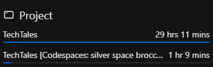

# TechTales - Blog Platform API

## 📌 Overview
TechTales is a modern blogging platform providing a comprehensive RESTful API for blog management, user authentication, and content interaction. Built using **Node.js, Express.js, and MongoDB**, it ensures scalability, security, and efficiency.

## Documentation & Resources

- **Documentation:** [TechTales Documentation](Documentation.md)
- **Postman Collection:** [Postman Collection](backend.postman_collection.json)
- **API Base URL:** [http://localhost:3000/api/v1/](http://localhost:3000/api/v1/)
- **GitHub Repository:** [Syed Tasavour](https://github.com/syedtasavour/TechTales)


## 🌟 Show Your Support
If you found this project helpful, give it a ⭐️!

## Project Time  
  
The total time spent on the project is 30 hours and 20 minutes.

## 🚀 Features

## 🛠️ Technologies Used
- **Backend:** Node.js, Express.js, MongoDB, Mongoose
- **Authentication:** JWT, bcrypt
- **Storage:** Cloudinary, Multer
- **Security:** Input Validation

### 🔐 Authentication & Authorization
- Secure **JWT-based authentication** with refresh tokens
- **Role-based access control** (Admin, Author, Reader)
- Password encryption and reset functionality

### 📝 Content Management
- **CRUD operations** for blog posts
- **Category management**
- **Rich text support** with media uploads (**Cloudinary**)

### 💬 User Engagement
- **Comments system** (Add, Edit, Delete)
- **Like/Unlike functionality**
- **View tracking** & analytics
- **User profile management**

### ⚡ Advanced Features
- **Search**
- **Pagination support**

## 🏁 Getting Started
### ✅ Prerequisites
- **Node.js** (v14+)
- **MongoDB** (Local/Atlas)
- **Cloudinary Account**
- **Git** installed

### 🔧 Installation
1. **Fork & Clone the Repository**
   ```bash
   git clone https://github.com/syedtasavour/TechTales.git
   cd TechTales
   ```
2. **Install dependencies**
   ```bash
   npm install
   ```
3. **Set up environment variables** (`.env` file)
   ```env
   PORT=8000
   MONGODB_URI=your_mongodb_uri
   JWT_SECRET=your_jwt_secret
   JWT_REFRESH_SECRET=your_refresh_token_secret
   CLOUDINARY_CLOUD_NAME=your_cloudinary_name
   CLOUDINARY_API_KEY=your_cloudinary_key
   CLOUDINARY_API_SECRET=your_cloudinary_secret
   ```
4. **Start the development server**
   ```bash
   npm run dev
   ```

## 📖 API Endpoints
### 🔑 Authentication
- `POST /auth/register` - Register new user
- `POST /auth/login` - User login
- `POST /auth/logout` - Logout
- `POST /auth/refresh-token` - Refresh access token
- `POST /auth/forgot-password` - Password reset initiation
- `POST /auth/reset-password` - Complete password reset

### 👤 User Management
- `GET /users/profile` - Get user profile
- `PUT /users/profile` - Update user details
- `PUT /users/avatar` - Upload/update avatar
- `DELETE /users` - Delete account

### 📝 Blog Posts
- `POST /posts` - Create new post
- `GET /posts` - Get all posts (Paginated)
- `GET /posts/:id` - Get single post
- `PUT /posts/:id` - Update post
- `DELETE /posts/:id` - Delete post
- `POST /posts/:id/like` - Like post
- `DELETE /posts/:id/like` - Unlike post

### 📂 Categories
- `POST /categories` - Create category
- `GET /categories` - List categories
- `PUT /categories/:id` - Update category
- `DELETE /categories/:id` - Delete category

### 💬 Comments
- `POST /posts/:id/comments` - Add comment
- `GET /posts/:id/comments` - Get comments
- `PUT /comments/:id` - Edit comment
- `DELETE /comments/:id` - Delete comment


## 📊 Roadmap
### **Phase 1 - Backend Enhancements**
- [ ] Advanced search functionality
- [ ] Email notifications
- [ ] Social authentication (Google, GitHub)
- [ ] Analytics dashboard
- [ ] CORS & Helmet for enhanced security
- [ ] API rate limiting to prevent abuse
- [ ] XSS & SQL Injection protection

### **Phase 2 - Frontend Development**
- [ ] React-based frontend
- [ ] Rich text editor
- [ ] Responsive UI
- [ ] Real-time updates

### **Phase 3 - Advanced Features**
- [ ] SEO optimization
- [ ] AI-powered content suggestions
- [ ] Multi-language support

## 🤝 Contributing
We welcome contributions! Follow these steps:
1. **Fork the repo**
2. **Create a new branch**
   ```bash
   git checkout -b feature/AmazingFeature
   ```
3. **Commit changes**
   ```bash
   git commit -m "Add AmazingFeature"
   ```
4. **Push & create a PR**
   ```bash
   git push origin feature/AmazingFeature
   ```

### Contribution Guidelines
- Write meaningful commit messages
- Update documentation if necessary

## 📄 License
This project is licensed under the **ISC License**. See [LICENSE](LICENSE) for details.

## 👤 Author
**Syed Tasavour**  
- GitHub: [@syedtasavour](https://github.com/syedtasavour)
- Portfolio: [syedtasavour.me](https://syedtasavour.me)


## 📞 Contact
For any queries or support:
- Email: `help@syedtasavour.me`
- GitHub Issues: [Create an issue](https://github.com/syedtasavour/TechTales/issues)

---
<div align="center">
  <sub>Built with passion (and a lot of coffee) by Syed Tasavour.</sub>
</div>


